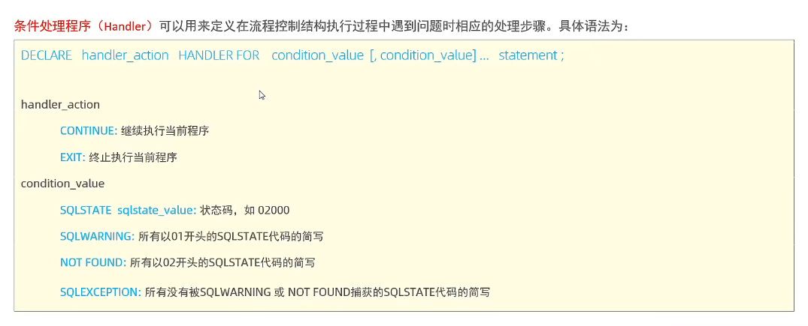

存储过程

**对于参数 in ，out ，inout**

```mysql
create procedure p4(in score int,out result varchar(10))
begin
    if score >= 85 then
        set result := 'excellent';
        elseif score >= 60 then
        set result := 'ordinary';
        else
        set result := 'bad';
    end if;
end;

call p4(98,@result);

select @result;
```


```mysql
create procedure p4(IN input int,out output varchar(20) )
    BEGIN
        if input = 30 then
            set output := '而立之年';
        elseif input > 30 then
            set output := '不惑之年';
        else
            set  output := '小孩子';
        end if;
        select output;
    END;
```


```mysql
create procedure p5(inout score double)
begin
    set score = (1/2) * score;
end;
/**
   先要对局部变量赋值，然后再调用存储过程，最后就可以查看以200分为总分，换算实际分数为100分的结果了
 */
set @score = 99;
call p5(@score);
select @score;
```


**case**

```mysql
create procedure p6(in month int)
BEGIN
    declare result varchar(20);
    case
        when month>=1 and month<=3 then
            set result := '第一季度';

        when month>=4 and month<=6 then
            set result := '第二季度';

        when month>=7 and month<=9 then
            set result := '第三季度';

        when month>=10 and month<=12 then
            set result := '第四季度';

        else
            set result = '输入不合法';
        end case ;
    select concat('您输入的月份是：',month,'月,是',result);
end;

call p6(11);
```


**循环while:**满足条件则操作

* 计算前n项和

```mysql
create procedure p7(IN n int)
BEGIN
-- 注意，此处如果不设置total的默认值，那么会默认为空，最终无论n的值多大，得到的total值都是null
    declare total int default 0; 
    while n > 0 do
        set total := total + n;
        set n := n-1;
        end while;
    select total;
end;


call p7(3);
```


**循环repeat：**满足条件则退出循环

* repeat是有条件的循环控制语句，当满足条件的时候退出循环

语法：

```
             REPEAT
                        SQL逻辑...
                        UNTIL 条件
             END REPEAT;
```


```mysql
CREATE procedure p8(IN n int)
BEGIN
    declare total int default 0;
    REPEAT

        set total := total + n;
        set n := n-1;
    until   n <= 0

        end repeat;
    select total;
end;

```


**loop循环：**

* LOOP实现简单的循环，如果不在SQL逻辑中增加退出循环的条件，可以用其来实现简单的死循环。LOOP可以配合以下两个语句使用:
* LEAVE:配合循环使用，退出循环。

* ITERATE:必须用在循环中，作用是跳过当前循环剩下的语句，直接进入下一次循环。.


```mysql
[begin_label:] LOOP   -- 中括号是该loop循环的名字
        SQL逻辑...
END LOOP [end_label];
```

```mysql
LEAVE label; -- 退出指定标记的循环体
ITERATE label; -- 直接进入下一次循环
```


* 计算前n项和

```mysql
create procedure p9(in n int)
BEGIN
    declare total int default 0;

    sum:loop
        if n <= 0 then
            leave sum;
        end if;

    set total := total + n;
        set n = n-1;
    end loop;

    select total;
end;

call p9(10);
```


* 计算前n项的偶数和

```mysql
create procedure p10(in n int)
BEGIN
    declare total int default 0;

    sum:loop
        if n <= 0 then
            leave sum ;
        end if;

        if n%2 != 0 then
           /*
             这里如果不对n的值减去1，将会造成死循环。原因如下：
             加入此时传来的值为5，此时n的值为奇数，所以代码会直接进入下一次的循环，下面的代码就不会执行，
             所以n值还是5，之后进入下一次循环传入的n值还是5，判断不是偶数继续不执行下面的代码，进入下一次循环，
             周而复始，一直结束不了循环
            */
            set n = n-1;
            iterate sum;
        end if;

        set total := total + n;
        set n = n-1;
    end loop;

    select total;
end;

```


-----


**游标cursor**

<font color=red>游标</font>（CURSOR）是用来存储查询结果集的数据类型，在存储过程和函数中可以使用游标对结果集进行循环的处理。游标的使用包括游标的声明、OPEN、FETCH和 CLOSE，其语法分别如下。

* 声明游标

```
DECLARE 游标名称 CURSOR FOR 查询语句;
```

* 打开游标

```
OPEN 游标名称;
```

* 获取游标记录

```
FETCH 游标名称 INTO变量[,变量];
```

* 关闭游标

```
CLOSE 游标名称;
```


* 根据传入的参数uage，来查询用户表tb_user中，所有的用户年龄小于等于uage的用户姓名(name)和专业（profession)，并将用户的姓名和专业插入到所创建的一张新表(id,name,profession)中。


```mysql
CREATE PROCEDURE p11(in uage int)
BEGIN
    -- 这里注意，要先声明普通变量再声明游标，否则会有语法错误
    DECLARE uname varchar(100);
    DECLARE upro varchar(100);
    -- 声明游标
   DECLARE u_cursor cursor for select name,profession FROM tb_user WHERE age <= uage;
   -- 声明一个条件处理程序，当while循环抓取不到数据，返回状态码02000时，关闭游标，执行退出操作,有四种写法
    DECLARE EXIT HANDLER FOR SQLSTATE '02000' CLOSE u_cursor;

   DROP table IF EXISTS tb_user_pro;
   -- 准备；创建表结构
   CREATE TABLE IF NOT EXISTS tb_user_pro(
       id INT PRIMARY KEY AUTO_INCREMENT,
       name varchar(100),
       profession varchar(100)
   );

   -- 开启游标
   open u_cursor;

   -- 通过while循环获取游标中的记录
   while true  do

   /*
   获取到了游标中的记录，并且赋值给了uname，upro这两个变量
   如果没有数据可以获取了，但循环还没退出，会报错 [02000][]1329]No data - zero rows fetched,or processed
   */
  FETCH u_cursor INTO uname,upro;

      -- 获取到了这两个个值，插入到新表tb_user_pro中
      INSERT INTO tb_user_pro(id,name,profession) values (
                                                          null,
                                                          uname,
                                                          upro
                                                         );
       end while;
    -- 关闭游标
    CLOSE u_cursor;

END;

```


* 条件处理程序




* crashcourse数据库中创建一个存储过程，并使用了一下

```mysql
CREATE PROCEDURE ordertotal(
        IN onumber INT,
        IN taxable BOOLEAN,
        OUT ototal DECIMAL(8,2)  -- 变量少了一个o字符
)COMMENT 'Obtain order total,optionally adding tax'
BEGIN
        -- Declare a variable for total
    DECLARE total DECIMAL(8,2);
        -- Declare tax percentage
    DECLARE taxrate INT DEFAULT 6;

        -- Get the order total
    SELECT SUM(item_price*quantity)
        FROM orderitems
            WHERE order_num = onumber
    INTO total;

        -- Is this taxable?
    IF taxable THEN
        -- Yes,so add taxrate to the total
        SELECT total+(total/100*taxrate) INTO total;
    end if;

        -- And finally,save to out variable
    SELECT total INTO ototal; -- ototal少了第一个字符'o'
END;

CALL ordertotal(20005,0,@ototal);
SELECT @ototal;

```

